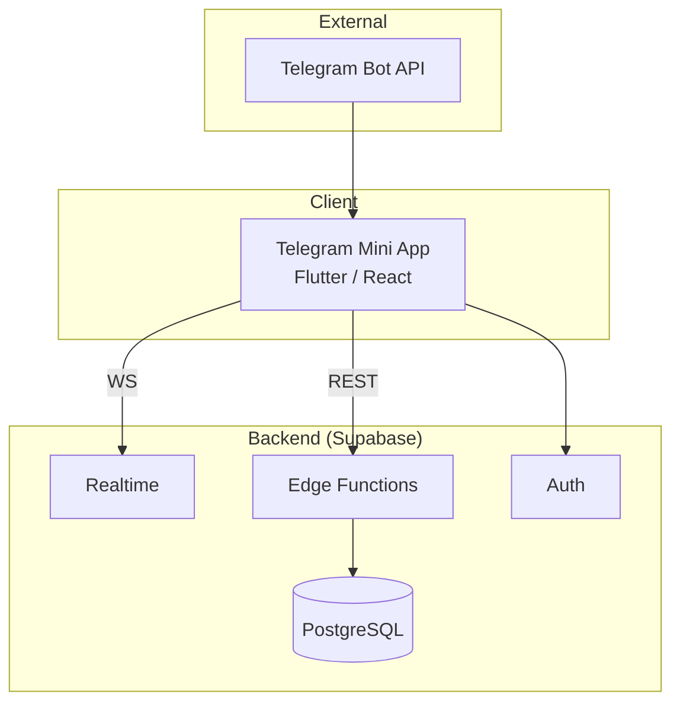
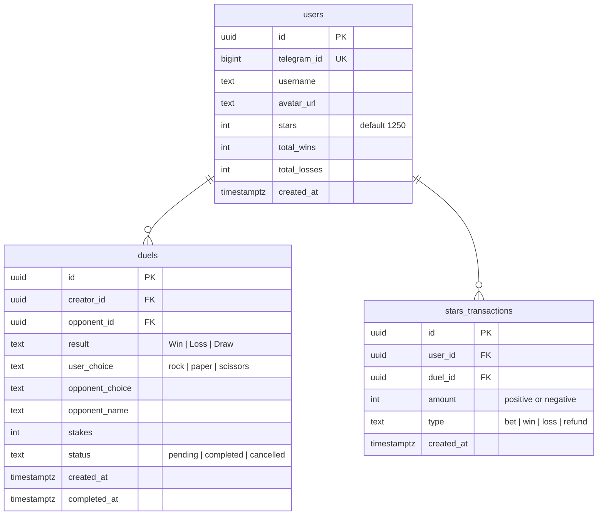
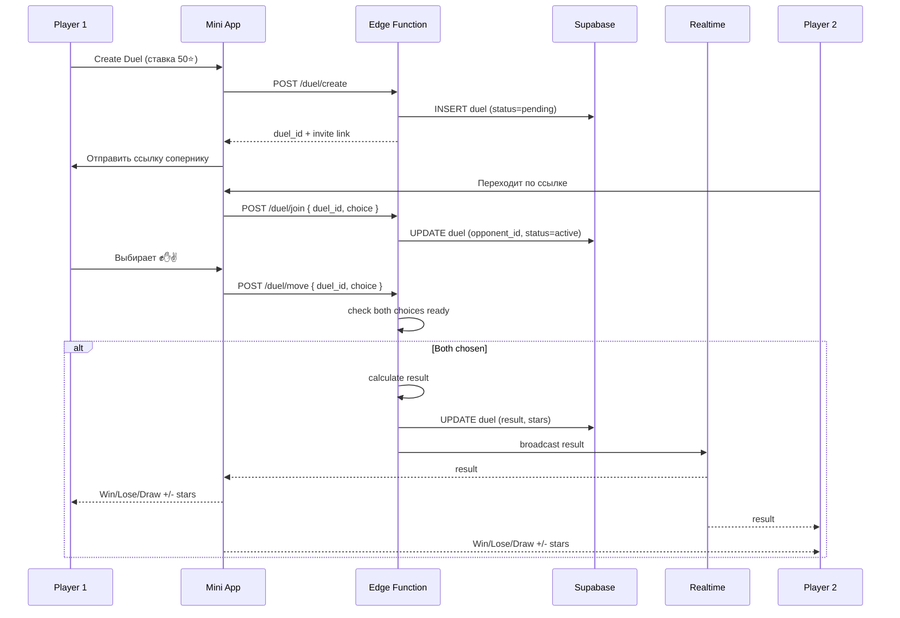
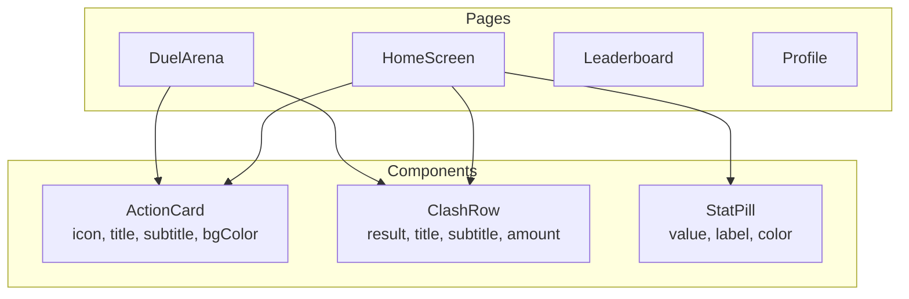

# Архитектура — Stars Clash

## 1. Системная архитектура



## 2. Навигация

```
HomeScreen (главная)
  ├── DuelArena (создание/поиск дуэли)
  ├── Leaderboard (таблица лидеров)
  ├── Profile (профиль)
  └── Settings (настройки)
```

## 3. Дизайн-токены

| Токен | Значение |
|-------|----------|
| **Фон** | `primaryBackground` (темный) |
| **Карточки** | `secondaryBackground` (чуть светлее фона) |
| **Акцент** | `primary` (главный цвет) |
| **Доп. акцент** | `tertiary` |
| **Текст** | `primaryText` / `secondaryText` |
| **Границы** | `alternate` |
| **Успех** | `success` (зеленый) |
| **Ошибка** | `error` (красный) |
| **Шрифт заголовков** | Outfit, w800-w900 |
| **Шрифт текста** | Plus Jakarta Sans, w400 |
| **Радиус** | 24 / 28 / 9999 (pill) |

## 4. Главный экран (HomeScreen)

```mermaid
graph TB
    subgraph "HomeScreen"
        HEADER[Row: Stars Clash<br/>Welcome, Commander<br/>⭐ 1250]
        MATCHMAKING[Matchmaking Card<br/>🎮 MATCHMAKING<br/>Gradient Shader BG]
        ACTIONS[Row: Create / Find<br/>ActionCard x2]
        PERFORMANCE[Your Performance Card<br/>Wins | Losses<br/>Win Rate]
        CLASHES[Latest Clashes<br/>ClashRow список]
    end
```

## 5. Layout HomeScreen

```
┌──────────────────────────────┐
│ STARS CLASH          ⭐ 1250 │
│ Welcome, Commander           │
├──────────────────────────────┤
│ ┌──────────────────────────┐ │
│ │     gradient bg          │ │
│ │       🎮                 │ │
│ │   MATCHMAKING            │ │
│ └──────────────────────────┘ │
│ ┌──────────┐ ┌──────────┐   │
│ │  Create  │ │   Find   │   │
│ │Start Duel│ │Matchmake │   │
│ └──────────┘ └──────────┘   │
│ ┌──────────────────────────┐ │
│ │ YOUR PERFORMANCE         │ │
│ │ ┌──────┐ ┌──────┐       │ │
│ │ │Wins  │ │Losses│       │ │
│ │ │  12  │ │   3  │       │ │
│ │ └──────┘ └──────┘       │ │
│ │ ─────────────────────── │ │
│ │ Win Rate          80%   │ │
│ └──────────────────────────┘ │
│ LATEST CLASHES    View All   │
│ ┌──────────────────────────┐ │
│ │ Win vs. @player          │ │
│ │ ✊ vs. ✋ • 2m ago   +50 │ │
│ └──────────────────────────┘ │
└──────────────────────────────┘
```

## 6. Data Model



## 7. Data Flow — Дуэль



## 8. Edge Functions

| Функция | Описание |
|---------|----------|
| `duel-create` | Создать дуэль, заморозить звезды |
| `duel-join` | Присоединиться к дуэли |
| `duel-move` | Сделать ход (КНБ) |
| `duel-resolve` | Подсчет результата, перевод звезд |
| `leaderboard` | Топ игроков по звездам |
| `profile-stats` | Статистика игрока |

## 9. Компоненты (Widget Tree)



## 10. App State

```yaml
userStars: 1250          # Текущий баланс звезд
historyFilter: "All"     # Фильтр истории
leaderboardCategory: "Total Stars"
```

## 11. Структура проекта

```
stars-clash/
├── lib/
│   ├── components/
│   │   ├── action_card/
│   │   ├── clash_row/
│   │   └── stat_pill/
│   ├── pages/
│   │   ├── home_screen/
│   │   ├── duel_arena/
│   │   ├── leaderboard/
│   │   └── profile/
│   ├── backend/
│   │   └── backend.dart
│   ├── flutter_flow/
│   └── main.dart
├── supabase/
│   ├── functions/
│   └── migrations/
└── pubspec.yaml
```
